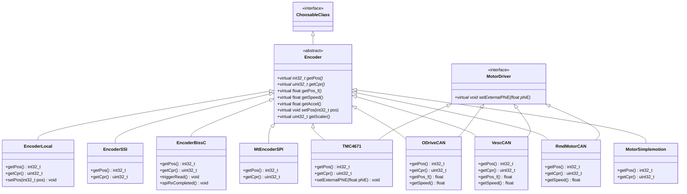
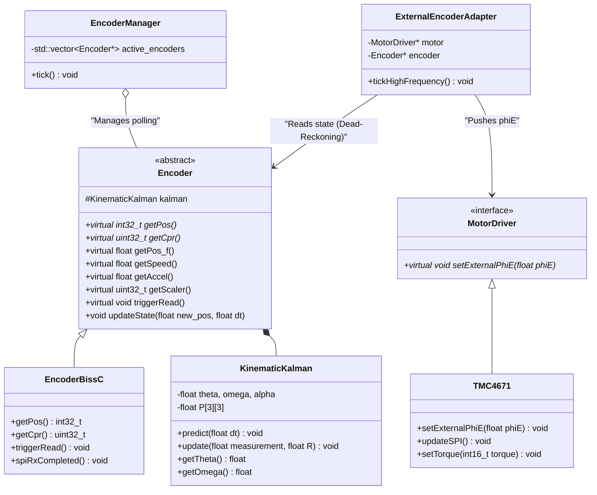
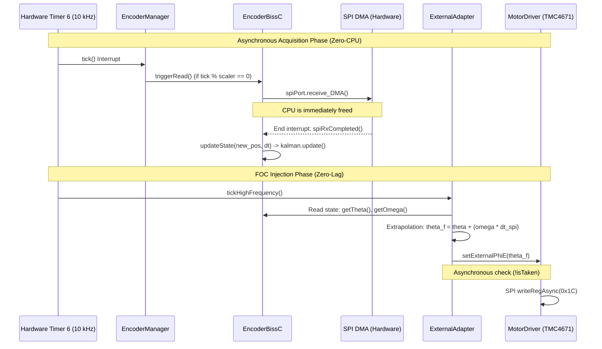
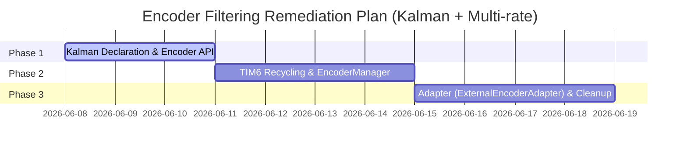

# In-depth Encoder Analysis & Filtering Remediation Plan (OpenFFBoard)

This document presents an architectural analysis of the position acquisition, velocity, and acceleration calculation system of OpenFFBoard. It details a remediation plan aimed at removing the Biquad filters from the Axis class in favor of a Kinematic Kalman Filter robust to the "Human-in-the-loop" concept, coupled with a new centralized multi-rate architecture built around the Encoder class.

---

## 1. Encoder Object Structures and Implementations

The base `Encoder` class inherits from `ChoosableClass`, allowing its dynamic selection in the GUI. Here is the comprehensive diagram of the current implementations and overridden virtual methods.

### Overrides Behavior
*   **Pure Sensors (Local, SSI, BissC, MtEncoderSPI)**: Must override `getPos()` and `getCpr()`. The central Kalman Filter will provide `getPos_f()`, `getSpeed()`, and `getAccel()` for them.
*   **Smart Controllers (ODriveCAN, VescCAN)**: Since these ESCs communicate raw position and speed as floating-point numbers (via their internal firmware), they **explicitly override `getPos_f()` and `getSpeed()`** to directly return the CAN bus data, thus bypassing the STM32 microcontroller calculations. The integer `getPos()` is then deduced by multiplying with the CPR.

---

## 2. Axis Class Analysis: Current Metrics and Filters

In `Axis.cpp`, velocity and acceleration are calculated at each iteration (1 kHz, $dT = 1\text{ ms}$) via Euler differentiation, then smoothed by two low-pass IIR Biquad filters (~40-60 Hz cutoffs).

### The Phase Lag Issue
In Force Feedback, a 40 Hz cutoff Biquad filter introduces about **90° of phase lag** at 40 Hz, resulting in a delay of $t_{\text{del}} \approx 6.25\text{ ms}$. This delay injects parasitic active energy, causing violent hands-off oscillations and forcing the dampening gains to be lowered.

---

## 3. Moving Metrics and Filters to the Encoder

Moving the calculation into `Encoder` offers clear advantages:
1.  **Encapsulation**: `Axis` now simply reads `encoder->getSpeed()`.
2.  **Hardware Bypass**: Smart controllers (VescCAN, ODriveCAN) will be able to return their direct internal estimator value, guaranteeing **zero MCU phase lag**.

---

## 4. Asynchronous Multi-Rate Architecture

To make the most of disparate sensors without saturating the CPU or RAM, the architecture will adopt a **hardware-paced asynchronous multi-rate** paradigm.

### 4.1. The Scaler (Temporal Polymorphism)
The idea is to decouple the encoder reading frequency from the FFB loop (1 kHz). Each child encoder class will define its own refresh constant as a multiplier (the `Scaler`), based on a maximum global system frequency (e.g., **10 kHz**):
*   `EncoderBissC` (High resolution): `scaler = 1` (Read at 10 kHz).
*   `EncoderLocal` (Low resolution): `scaler = 10` (Read at 1 kHz).

### 4.2. Resource Protection: The EncoderManager
To avoid creating an RTOS Thread per active encoder (which would saturate the STM32's very limited Stack RAM), the system will implement a centralized manager: the `EncoderManager`.
It will iterate over the list of active encoders and apply the scaler trigger logic to launch asynchronous DMA transfers (Zero-CPU-Cost).

### 4.3. Hardware Timer Recycling (Zero Jitter)
To pace the `EncoderManager` at exactly 10 kHz without suffering from OS timing instabilities (FreeRTOS Jitter), the plan is to **recover and recycle Timer 6 (`TIM_TMC` / `htim6`)**.
Historically used by the TMC4671 at 4 kHz (ARR=250), this hardware component (Basic Timer) will be renamed (e.g., `TIM_SENSOR`) and configured at 10 kHz (ARR=100) to generate the master interrupt of the acquisition architecture.

### 4.4. The "Adapter" Design Pattern and Injection (Dead-Reckoning)
Currently, the `TMC4671` class is a "God Object" managing an internal thread to spy on the encoder.
This behavior will be decoupled by creating an **`ExternalEncoderAdapter`**.
*   **Dependency Inversion (SOLID)**: The Adapter is not coupled to the TMC. It takes a generic `MotorDriver` interface as a parameter, which exposes a virtual `setExternalPhiE(phi_e)` method. The `TMC4671` will implement this method.
*   **Dead-Reckoning (Extrapolation)**: On the 10 kHz tick, the Adapter will read the encoder state (Kalman Filter: $\theta, \omega, \alpha$). It will extrapolate the exact future position to compensate for the SPI transfer latency: $\theta_{now} = \theta_{Kalman} + \omega_{Kalman} \cdot \Delta t$.
*   **Zero-Lag Injection**: The position pushed to the `MotorDriver` guarantees perfect rotor alignment ($I_d = 0$), reducing motor heating and maximizing torque.

### 4.5. Final Class Diagram and Interaction Sequence

The following diagram illustrates the target architecture, with precise C++ signatures (pure virtual `*`, virtual, and concrete).

#### Asynchronous Interaction Sequence (BiSS-C & TMC Example)

---

## 5. The Solution: Kinematic Kalman Filter

The Kalman Filter mathematically handles the uncertainty of human behavior (asynchronous torque):
*   **Process Matrix ($Q$)**: Human action is modeled as acceleration noise.
*   **Measurement Matrix ($R$)**: Calculated via the physical resolution of the encoder: $R = \frac{(2\pi / \text{CPR})^2}{12}$.
*   **Innovation Inversion ($S$) in $O(1)$**: The Kalman matrix inversion is reduced here to the inverse of a simple scalar: $S = P_{0,0} + R$, executable in $\sim 14$ clock cycles on the Cortex-M4 hardware FPU.

---

## 6. 3-Phase Remediation Plan

### Phase 1: API Expansion and Kalman Filter
*   Create a utility class `KinematicKalman`.
*   Add `getSpeed()`, `getAccel()`, `getScaler()`, and `triggerRead()` to `Encoder.h`.

### Phase 2: Centralization via EncoderManager and Timer 6
*   Recycle `TIM_TMC` (Timer 6) into `TIM_SENSOR` (10 kHz, ARR=100).
*   Create `EncoderManager` driven by this timer to manage scalers and asynchronous DMA calls (BiSS-C).

### Phase 3: Driver Decoupling, Dead-Reckoning, and Axis Cleanup
*   Create the abstract interface `MotorDriver` with `setExternalPhiE(phi_e)`.
*   Make `TMC4671` implement the interface.
*   Create `ExternalEncoderAdapter` to push the extrapolated angle to the `MotorDriver`.
*   Remove internal threads/timers from `TMC4671.cpp`.
*   Remove Biquad instances from `Axis.h` and `Axis.cpp`, point the force feedback directly to `encoder->getSpeed()`.
