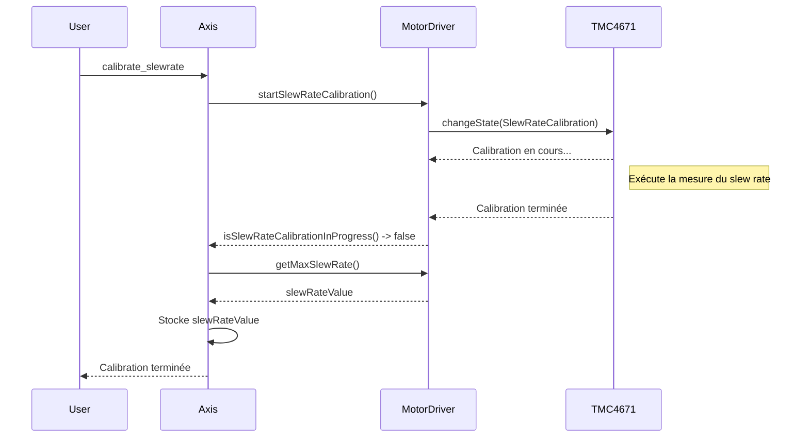

# Conception de la détection du Slew Rate Maximum

Ce document décrit la conception de la détection et de l'utilisation du Slew Rate Maximum dans le firmware OpenFFBoard.

## 1. Objectifs

*   **Flexibilité :** La conception doit permettre de supporter différents types de drivers, qu'ils aient ou non une capacité de détection de slew rate intégrée.
*   **Robustesse :** Le système doit être capable de gérer les cas où le slew rate ne peut pas être mesuré.
*   **Centralisation de la logique :** La classe `Axis` doit rester le point central de la gestion des paramètres de l'axe, y compris le slew rate.

## 2. Architecture proposée

### 2.1. `MotorDriver` (Classe de base)

La classe `MotorDriver` est étendue avec une interface de calibration :

*   `virtual void startSlewRateCalibration()`: Lance la procédure de calibration du slew rate. L'implémentation par défaut ne fait rien. Les sous-classes qui supportent la calibration (comme `TMC4671`) surchargeront cette méthode.
*   `virtual bool isSlewRateCalibrationInProgress()`: Retourne `true` si une calibration est en cours.
*   `virtual uint16_t getMaxSlewRate()`: Retourne le slew rate maximum mesuré ou une valeur par défaut.

### 2.2. `TMC4671` (Implémentation spécifique)

La classe `TMC4671` implémentera l'interface de calibration :

*   `startSlewRateCalibration()`: Fait passer la machine à états interne à l'état `SlewRateCalibration`.
*   `isSlewRateCalibrationInProgress()`: Retourne `true` si l'état est `SlewRateCalibration`.
*   `getMaxSlewRate()`: Retourne la valeur de slew rate stockée dans les registres du TMC4671 après la calibration.

### 2.3. `Axis`

La classe `Axis` gère la logique de haut niveau :

*   **Commande utilisateur :** Une commande `calibrate_slewrate` est ajoutée à `Axis`. Lorsqu'elle est appelée, elle exécute `driver->startSlewRateCalibration()`.
*   **Sondage :** `Axis` peut sonder `driver->isSlewRateCalibrationInProgress()` pour informer l'utilisateur de la fin de la calibration.
*   **Récupération de la valeur :** Une fois la calibration terminée, `Axis` appelle `driver->getMaxSlewRate()` pour récupérer la valeur et la stocke.
*   **Fallback :** Si `getMaxSlewRate()` retourne une valeur indiquant que la calibration n'est pas supportée, `Axis` utilise la puissance maximale (`power`) comme limite pour le slew rate, assurant ainsi un comportement sûr.
*   **Interface utilisateur :** L'IHM (Configurator) peut utiliser ces commandes pour permettre à l'utilisateur de lancer la calibration et de visualiser la valeur mesurée.

## 3. Diagramme de séquence

## 4. Avantages de cette conception

*   **Découplage :** `Axis` n'a pas besoin de connaître les détails de la machine à états du TMC4671.
*   **Extensibilité :** Il est facile d'ajouter de nouveaux drivers avec leurs propres mécanismes de calibration.
*   **Sécurité :** Le mécanisme de fallback garantit que le système reste stable même avec des drivers non-calibrables.
